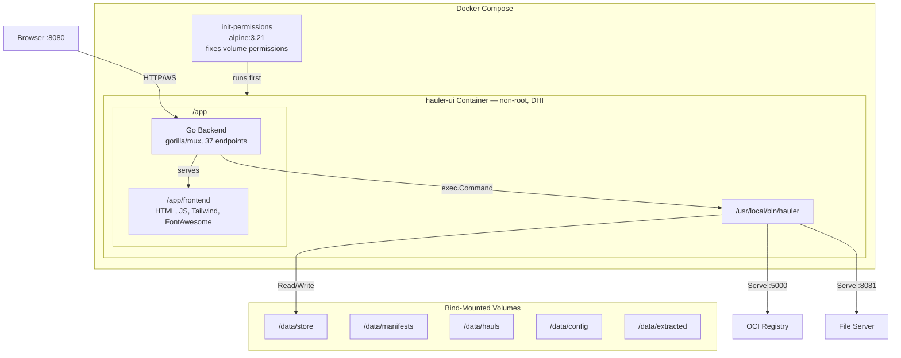
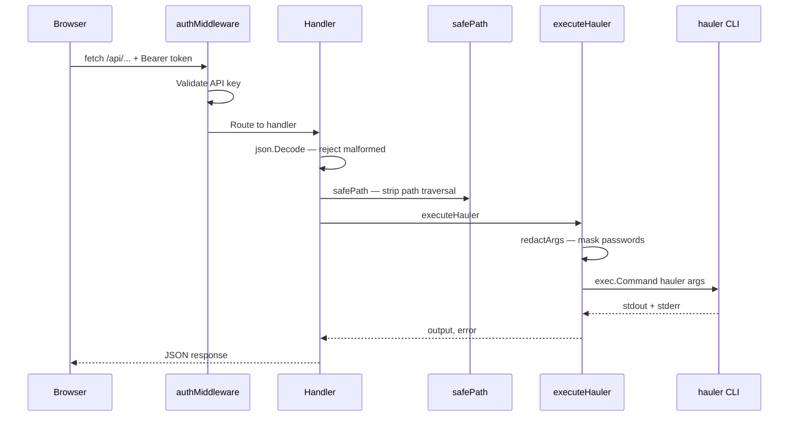

# Hauler UI - Enhanced Web Interface


**A modern, feature-complete web interface for [Rancher Government Hauler](https://hauler.dev) with 100% CLI flag coverage.**

> 🤖 **Built with Agentic Prompt Engineering** - This project was developed using advanced AI-assisted development methodologies, leveraging multi-agent collaboration for requirements analysis, architecture design, implementation, testing, and security review.

---

## 📋 Table of Contents

- [Overview](#overview)
- [Features](#features)
- [Quick Start](#quick-start)
- [Architecture](#architecture)
- [Security](#security)
- [Development](#development)
- [Documentation](#documentation)
- [Contributing](#contributing)
- [License](#license)

---

## 🎯 Overview

Hauler UI provides a comprehensive web-based interface for Hauler, the airgap Swiss Army knife for Kubernetes. It simplifies content management, manifest creation, and registry operations through an intuitive interface while maintaining 100% feature parity with the Hauler CLI.

### Key Highlights

- ✅ **100% Feature Coverage** - All 72 Hauler CLI flags implemented
- 🎨 **Modern UI** - Responsive design with Tailwind CSS
- 🔒 **Airgap Ready** - All assets bundled, no external dependencies
- 🐳 **Docker Native** - Single container deployment
- 📦 **Interactive Content Selection** - Browse and select charts/images visually
- 🔐 **Security Hardened** - API key auth, path traversal protection, XSS prevention, credential redaction, WebSocket origin validation

---

## ✨ Features

### Core Functionality

#### Store Management
- **Add Content**: Charts, images, and files with full option support
- **Sync Store**: From manifests with platform selection and signature verification
- **Save/Load**: Create and restore hauls with compression
- **Clear Store**: Remove all content or individual artifacts
- **Store Info**: Real-time store statistics and content listing

#### Repository Management
- **Add/Remove Repositories**: Manage Helm chart repositories
- **Browse Charts**: Interactive chart browser with version selection
- **Batch Operations**: Select multiple charts and add in one operation
- **Repository Search**: Find charts across configured repositories

#### Registry Operations
- **Configure Registries**: Store registry credentials securely
- **Push Content**: Copy store contents to private registries
- **Authentication**: Login/logout from registries
- **Test Connections**: Verify registry connectivity

#### Advanced Features
- **Signature Verification**: Cosign key upload and verification
- **Platform Selection**: Multi-architecture support (amd64, arm64, arm/v7)
- **Rewrite Paths**: Customize registry paths during content addition
- **TLS Support**: Upload certificates for secure registry/fileserver
- **Serve Mode**: Built-in registry and fileserver with TLS
- **Live Logs**: Real-time command output via WebSocket

### Complete Flag Coverage

| Command | Flags Supported | Coverage |
|---------|----------------|----------|
| `store add chart` | 17/17 | 100% |
| `store add image` | 11/11 | 100% |
| `store add file` | 2/2 | 100% |
| `store sync` | 13/13 | 100% |
| `store save` | 3/3 | 100% |
| `store load` | 1/1 | 100% |
| `store copy` | 3/3 | 100% |
| `store serve` | 7/7 | 100% |
| `store info` | 0/0 | 100% |
| `store extract` | 1/1 | 100% |
| `store remove` | 1/1 | 100% |
| `login/logout` | 3/3 | 100% |
| **TOTAL** | **72/72** | **100%** |

---

## 🚀 Quick Start

### Prerequisites

- Docker & Docker Compose
- 2GB RAM minimum
- 10GB disk space for store

### Installation

```bash
# Clone repository and enter the web UI directory
git clone https://github.com/hauler-dev/hauler.git
cd hauler/feat:dockerfile-webui

# Build and start (pre-creates data dirs + init container fixes permissions)
make build
make run

# Access the UI
open http://localhost:8080
```

### Ports

| Port | Service |
|------|---------|
| 8080 | Web UI |
| 5000 | OCI Registry (when serving) |
| 8081 | File Server (when serving) |

### API Authentication (optional)

Set `HAULER_UI_API_KEY` in `docker-compose.yml` to require a Bearer token on all API calls:

```yaml
environment:
  - HAULER_UI_API_KEY=your-secret-key-here
```

### First Steps

1. **Add a Repository**
   - Navigate to "Repositories" tab
   - Add Helm repository (e.g., https://charts.bitnami.com/bitnami)

2. **Browse and Add Charts**
   - Click "Browse" on your repository
   - Select charts and versions
   - Click "Add Selected Charts to Store"

3. **Save to Haul**
   - Go to "Store" tab
   - Click "Save to Haul"
   - Download the generated haul file

4. **Push to Registry** (Optional)
   - Configure your registry in "Push to Registry" tab
   - Click "Push All Content to Registry"

---

## 🏗️ Architecture

### System Architecture



### Request Flow



### Technology Stack

**Backend:**
- Go 1.21
- Gorilla Mux (HTTP routing)
- Gorilla WebSocket (real-time logs)
- Hauler CLI integration

**Frontend:**
- Vanilla JavaScript (obfuscated in build)
- Tailwind CSS 3.x
- Font Awesome 6.x
- WebSocket client

**Infrastructure:**
- Docker Hardened Images (DHI) — multi-stage build, non-root runtime
- Init container for bind-mount permissions
- Persistent volumes
- Health checks

---

## 🔒 Security

### Current Status

**Version:** v3.3.5
**Security Level:** 🟢 Hardened

### Security Features

| Feature | Implementation |
|---------|---------------|
| **API Authentication** | Optional API key via `HAULER_UI_API_KEY` env var. Bearer token on all `/api/*` routes. |
| **Path Traversal Protection** | `safePath()` calls `filepath.Base()` on every user-supplied filename. Rejects `..`, `.`, empty. |
| **XSS Prevention** | `escapeHTML()` for innerHTML, `escapeAttr()` for onclick/attribute contexts. |
| **Credential Redaction** | `redactArgs()` masks `--password`/`-p` values in logs. Registry list masks passwords as `***`. |
| **WebSocket Origin Validation** | `CheckOrigin` validates Origin header matches the request Host. |
| **Input Validation** | All `json.Decode` calls check errors (400). All `io.Copy` calls check errors (500). |
| **Content-Type Headers** | `application/json` set on every JSON response. |
| **Certificate Validation** | CA cert uploads validated as proper PEM with x509 parsing. |
| **JS Obfuscation** | Control flow flattening, dead code injection, string array encoding (base64). |
| **Container Hardening** | Docker Hardened Images, non-root runtime, no shell in production image. |

See [docs/SECURITY.md](docs/SECURITY.md) for full details.

---

## 💻 Development

### Project Structure

```
hauler-ui/
├── backend/
│   ├── main.go           # Go backend (37 endpoints)
│   ├── go.mod
│   └── go.sum
├── frontend/
│   ├── index.html        # Main UI
│   ├── app.js            # JavaScript (obfuscated in build)
│   ├── tailwind.min.js   # Tailwind CSS
│   ├── fontawesome.min.css
│   └── webfonts/         # Font Awesome fonts
├── docs/
│   ├── agents/           # Multi-agent development docs
│   ├── FEATURES.md
│   ├── SECURITY.md
│   ├── TESTING.md
│   └── REWRITE_FLAG_EXPLANATION.md  # Registry path rewriting guide
├── tests/
│   ├── security_scan.sh
│   ├── comprehensive_test_suite.sh
│   └── reports/
├── scripts/
│   ├── cleanup.sh        # Development cleanup
│   ├── obfuscate.sh      # Manual JS obfuscation
│   └── qa-dependencies.sh  # Dependency validation
├── Dockerfile            # Multi-stage build with DHI + obfuscation
├── Dockerfile.security   # Security scanning container
├── docker-compose.yml    # Includes init-permissions service
├── Makefile              # build, run, stop, clean, logs, restart, shell
└── README.md
```

### Building from Source

```bash
# Build Docker image
docker build -t hauler-ui:latest .

# Run locally
docker compose up -d

# View logs
docker compose logs -f

# Stop
docker compose down
```

### Development Mode

```bash
# Backend development
cd backend
go run main.go

# Frontend development (no obfuscation)
# Edit frontend/app.js directly
# Refresh browser to see changes
```

### Running Tests

```bash
# Comprehensive test suite
./tests/comprehensive_test_suite.sh

# Security scan
./tests/security_scan.sh

# Agent tests
./tests/run_agent_tests.sh
```

---

## 📚 Documentation

### User Documentation

- **[Quick Start Guide](docs/QUICK_START_V2.1.md)** - Get started in 5 minutes
- **[Features Guide](docs/FEATURES.md)** - Complete feature documentation
- **[UI Guide](docs/UI_README.md)** - UI walkthrough with screenshots
- **[Rewrite Flag Guide](docs/REWRITE_FLAG_EXPLANATION.md)** - Understanding registry path rewriting

### Technical Documentation

- **[Architecture](docs/agents/02_SDM_EPIC.md)** - System architecture and design
- **[API Reference](docs/agents/05_SENIOR_DEV_IMPLEMENTATION.md)** - All 37 API endpoints
- **[Security](docs/SECURITY.md)** - Security considerations and best practices
- **[Testing](docs/TESTING.md)** - Test strategy and execution

### Development Documentation

- **[Agent Collaboration](docs/agents/README.md)** - Multi-agent development process
- **[Implementation Details](docs/agents/30_TRUE_100_PERCENT_COMPLETE.md)** - Complete implementation
- **[Deployment Checklist](docs/DEPLOYMENT_CHECKLIST.md)** - Production deployment guide

### GitLab Wiki

See the [GitLab Wiki](../../wikis/home) for:
- Installation guides
- Configuration examples
- Troubleshooting
- FAQ
- Video tutorials

---

## 🤖 Agentic Prompt Engineering

This project was developed using **Agentic Prompt Engineering**, a cutting-edge AI-assisted development methodology that leverages multiple specialized AI agents working in collaboration.

### Development Process

```
Product Manager Agent
    ↓ Requirements Analysis
Software Development Manager Agent
    ↓ Epic Creation & Sprint Planning
Senior Developer Agents
    ↓ Implementation (Backend + Frontend)
QA Agent ← → Security Agent
    ↓ Testing & Security Review
Technical Writer Agent
    ↓ Documentation
```

### Agent Contributions

**Product Manager Agent:**
- Customer requirements analysis
- Feature prioritization
- Business impact assessment
- Success criteria definition

**Software Development Manager Agent:**
- EPIC creation
- Sprint planning
- Technical architecture
- Resource allocation

**Senior Developer Agents:**
- Backend implementation (Go)
- Frontend implementation (JavaScript)
- API design
- Integration

**QA Agent:**
- Test plan creation
- Test execution
- Bug reporting
- Quality assurance

**Security Agent:**
- Threat modeling
- Vulnerability assessment
- Security recommendations
- Remediation verification

**Technical Writer Agent:**
- Documentation creation
- README maintenance
- Wiki management
- User guides

### Benefits of Agentic Development

✅ **Comprehensive Coverage** - Multiple perspectives ensure nothing is missed  
✅ **Quality Assurance** - Built-in testing and security review  
✅ **Documentation** - Automatically generated and maintained  
✅ **Rapid Development** - Parallel workstreams and efficient collaboration  
✅ **Best Practices** - Each agent brings domain expertise  

### Agent Artifacts

All agent deliverables are preserved in [docs/agents/](docs/agents/):
- Requirements analysis
- Architecture documents
- Implementation details
- Test plans
- Security assessments
- Completion reports

---

## 🤝 Contributing

We welcome contributions! Please see our [Contributing Guide](CONTRIBUTING.md) for details.

### Development Workflow

1. Fork the repository
2. Create a feature branch (`git checkout -b feature/amazing-feature`)
3. Commit your changes (`git commit -m 'Add amazing feature'`)
4. Push to the branch (`git push origin feature/amazing-feature`)
5. Open a Merge Request

### Code Standards

- Go: `gofmt`, `golint`
- JavaScript: ESLint (when not obfuscated)
- Commit messages: Conventional Commits
- Documentation: Markdown with proper formatting

---

## 📄 License

This project is licensed under the Apache License 2.0 - see the [LICENSE](LICENSE) file for details.

---

## 🙏 Acknowledgments

- **Rancher Government** - For creating Hauler
- **Hauler Community** - For feedback and support
- **AI Development Team** - Multi-agent collaboration made this possible
- **Open Source Community** - For the amazing tools and libraries

---

## 📞 Support

- **Issues:** [GitLab Issues](../../issues)
- **Discussions:** [GitLab Discussions](../../discussions)
- **Wiki:** [GitLab Wiki](../../wikis/home)
- **Hauler Docs:** [https://hauler.dev](https://hauler.dev)

---

## 🗺️ Roadmap

### v3.3.5 (Security Hardened) - Current
- ✅ Input sanitization and XSS prevention
- ✅ Credential redaction in logs
- ✅ API key authentication
- ✅ Path traversal protection
- ✅ WebSocket origin validation
- ✅ Docker Hardened Images
- ✅ Bind-mount permission handling

### v3.5.0 (Enhanced Features) - Q2 2026
- 🔄 RBAC (Role-Based Access Control)
- 🔄 Audit logging
- 🔄 Metrics and monitoring
- 🔄 Multi-user support

### v4.0.0 (Enterprise Ready) - Q3 2026
- 🔄 LDAP/SAML integration
- 🔄 High availability
- 🔄 Backup/restore
- 🔄 Advanced reporting

---

**Built with ❤️ using Agentic Prompt Engineering**

**Version:** 3.3.5  
**Last Updated:** 2026-01-22  
**Status:** Production Ready (after security hardening)
